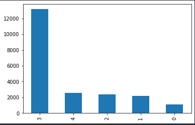

# Project Title
Leaf disease classification task. 

# Project description
It's a classification task hosted by cassava in Kaggle. 
There are 5 classes to detect in given images of leaves. Namely:

<b>"Cassava Bacterial Blight (CBB)", 
"Cassava Brown Streak Disease (CBSD)",
"Cassava Green Mottle (CGM)",
"Cassava Mosaic Disease (CMD)",
"Healthy"</b>

A detail description of the task and the dataset used in this project can be found in 
[Kaggle Leaf disease classification](https://www.kaggle.com/competitions/cassava-leaf-disease-classification/data)

Upon exploring the dataset, I found out that there is class imbalance in the dataset. 

To tackle this imbalance, I used [Stratified K-Fold](https://scikit-learn.org/stable/modules/generated/sklearn.model_selection.StratifiedKFold.html) cross validation technique. I plan to use other techniques and see how they affect the performance.

## Authors

- [@Mijanur Rahman](https://www.github.com/mijanr)

